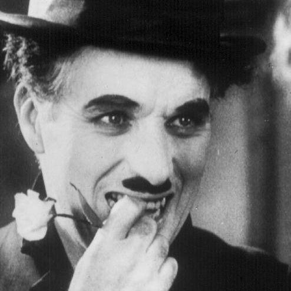

### Facial expression classification using AlexNet [1]

The AffectNet [2] dataset was used for network training.
Τhe classification of images consists of six emotions:
1. Neutral
2. Happy
3. Sad
4. Suprise
5. Anger
6. Fear


#### References:

[1] Alex Krizhevsky, Ilya Sutskever, Geoffrey E. Hinton, «ImageNet Classification with Deep Convolutional Neural Networks», 2012

[2] Ali Mollahosseini, Behzad Hasani, d Mohammad H. Mahoor, «AffectNet: A Database for Facial Expression, Valence, and Arousal Computing in the Wild», 2017

#### Examples of correct facial expression prediction:


<p float="left">
  
   
    
</p>

##### &nbsp;&nbsp;&nbsp;&nbsp;&nbsp;&nbsp;&nbsp;&nbsp;&nbsp;&nbsp;&nbsp; (a) neutral &nbsp;&nbsp;&nbsp;&nbsp;&nbsp;&nbsp;&nbsp;&nbsp;&nbsp;&nbsp;&nbsp;&nbsp;&nbsp;&nbsp;&nbsp; (b) happy &nbsp;&nbsp;&nbsp;&nbsp;&nbsp;&nbsp;&nbsp;&nbsp;&nbsp;&nbsp;&nbsp;&nbsp;&nbsp;&nbsp;&nbsp;&nbsp;&nbsp;&nbsp;&nbsp;&nbsp;&nbsp;&nbsp;&nbsp;&nbsp;&nbsp; (c) sad &nbsp;&nbsp;&nbsp;&nbsp;&nbsp;&nbsp;&nbsp;&nbsp;&nbsp;&nbsp;&nbsp;&nbsp;&nbsp;&nbsp;&nbsp;&nbsp;&nbsp;&nbsp;&nbsp;&nbsp;&nbsp; 
<p float="left">
  
   
  
   
</p>

##### &nbsp;&nbsp;&nbsp;&nbsp;&nbsp;&nbsp;&nbsp;&nbsp;&nbsp;&nbsp;&nbsp; (a) neutral &nbsp;&nbsp;&nbsp;&nbsp;&nbsp;&nbsp;&nbsp;&nbsp;&nbsp;&nbsp;&nbsp;&nbsp;&nbsp;&nbsp;&nbsp; (b) happy &nbsp;&nbsp;&nbsp;&nbsp;&nbsp;&nbsp;&nbsp;&nbsp;&nbsp;&nbsp;&nbsp;&nbsp;&nbsp;&nbsp;&nbsp;&nbsp;&nbsp;&nbsp;&nbsp;&nbsp;&nbsp;&nbsp;&nbsp;&nbsp;&nbsp; (c) sad &nbsp;&nbsp;&nbsp;&nbsp;&nbsp;&nbsp;&nbsp;&nbsp;&nbsp;&nbsp;&nbsp;&nbsp;&nbsp;&nbsp;&nbsp;&nbsp;&nbsp;&nbsp;&nbsp;&nbsp;&nbsp; 

### Requirements 
```
Python (suggested 3.7.1)  
Numpy   
os-sys  
OpenCv  
Keras (suggested 2.4.3)  